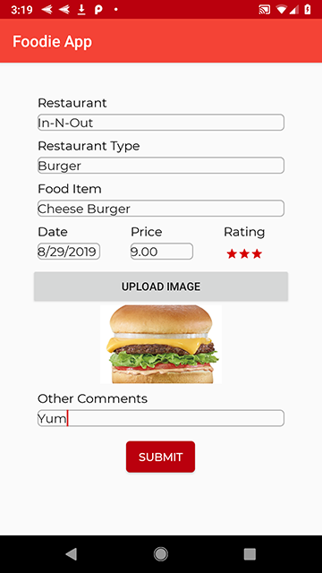

# Android

Foodie App allows users to document information about the food they have eaten. Users are able to create new food entries with the following information: such as the name of the restaurant, the restaurant type, what they ordered, the date they ate there, the price, how they rate it, attach an image and make any other comments. Those created entries can then be accessed to update with either new information or deleted from the list. 

Foodie App was created by a three person Android team within four days. 

The user is able to sign in. If the user does not have an account, they can click on the "Register" button.

If the register button is clicked, it will take the user to the Registration Page. After the user has entered their information on the Registration page, the user is then brought back to the Sign In Page. 

After the user signs into their account, they are brought to the Homepage. 

From the Homepage, the user can click on their profile to update their information. The Profile Page will open. 

If the user clicks on the "+" it will add a new food entry. The New Entry will open. 

After the entry has been entered, it will populate onto the Homepage. 

